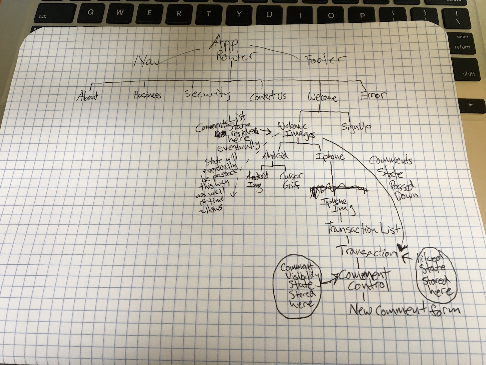

# Venmo Clone

#### _Clone of the Venmo homepage._

#### By _**Isaac Shoman**_

## Description

_This project is a clone of Venmo's homepage (https://venmo.com/) using React. The main focus is on the iphone/android images and adding interactivity to them in way that Venmo does not have (being able to like and store comments)._

## Component Tree

I decided to add state to the WelcomeImages Component because eventually I want a user to be able to click the android phone, enter text, and create new transaction objects. And WelcomeImages is the lowest common ancestor between the Iphone and Android components.

I added state for whether a transaction was liked or not in the Transaction component as that is the only place it will need to be accessed. The same thing for state being added to Comment Control. As these both act as "show/hide" booleans that determine what is rendered within each component.

## Setup/Installation Requirements

* _Clone Repository to Desktop_
* _Navigate to directory in Terminal_
* _Run NPM install_
* _Run 'npm run start'_

## Known Bugs

* When "Comment" is clicked the generic input becomes visible but overlaps other content. I have not attempted to style it yet.
* There is not a submit button/functionality that actually stores comments for the transaction.

## Support and Contact Details

_You may email me at isaac.shoman@gmail.com with any questions or feedback_

## Technologies Used

_React_
_Node package manager_
_MomentJS_
_UUID_

### License

*This website is licensed under an MIT License*

Copyright (c) 2018 **_Isaac Shoman_**
